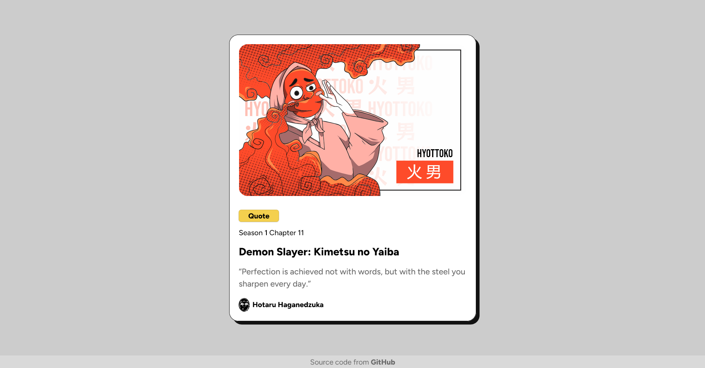

# Blog Preview Card Landing Page

## Table of Contents

* [Overview](#overview)

  * [Screenshot](#screenshot)
  * [Links](#links)
* [My Process](#my-process)

  * [Built With](#built-with)
  * [Resources](#resources)
* [Author](#author)

## Overview

This project is a **Blog Preview Card Landing Page**.
It features a clean and modern design that highlights a blog post preview in a visually appealing card layout.

The page is **fully responsive**, built with a **mobile-first workflow**, and utilizes **semantic HTML** along with **CSS Flexbox** for a flexible and accessible layout. It’s a great example of a small, real-world component that can be integrated into larger projects.

### Screenshot

### Links

* **Solution URL:** [GitHub Repository](https://github.com/Faustze/card-preview)
* **Live Site URL:** [View Live](https://faustze.github.io/card-preview/)

## My Process

### Built With

* **Semantic HTML5** markup for better accessibility and SEO
* **CSS Custom Properties** for easier theming and maintainability
* **Flexbox** for layout and alignment
* **Mobile-First Workflow** to ensure responsiveness on all devices

### Resources

* This project is a solution to the [Blog Preview Card challenge on Frontend Mentor](https://www.frontendmentor.io/challenges/blog-preview-card-ckPaj01IcS). Frontend Mentor challenges help improve coding skills by building real-world projects.
* [HSL Color Picker](https://www.hslpicker.com) — used to select the perfect color palette
* [WCAG AA Checker](https://www.siegemedia.com)
* [Figtree font](https://fonts.google.com/specimen/Figtree)

## Author

* **GitHub Profile:** [Faustze](https://github.com/Faustze)
* **Frontend Mentor:** [@Faustze](https://www.frontendmentor.io/profile/Faustze)
